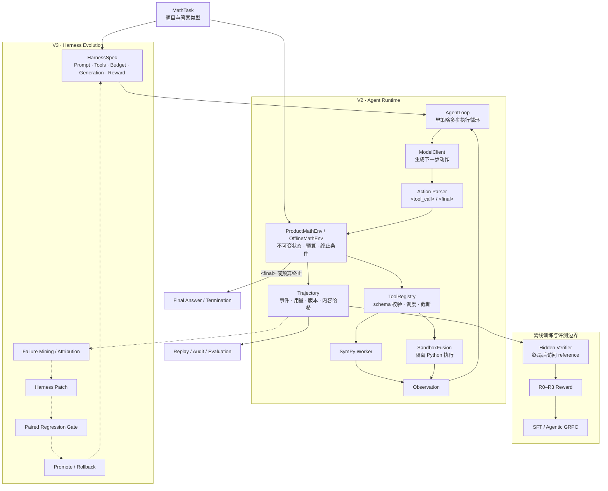
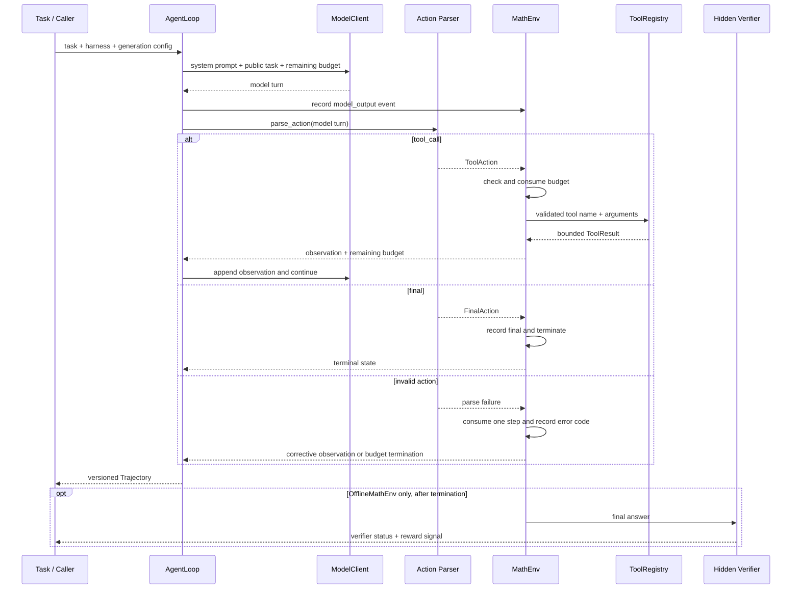

# EvoMath Harness

> A Sustainable Self-Evolving Math Agent Harness

EvoMath Harness 是一个面向数学推理的开源研究与工程项目。仓库保留了项目三代架构的演进轨迹：V1 验证复杂任务编排，V2 建立可复现的 Agentic RL 训练与评测链路，V3 在此基础上探索 Harness 的自动评估、晋升与回滚。

项目当前以 Python 3.12 和 `uv` 管理环境。V1 原型被完整保留用于对照；活跃开发集中在 `src/adaptive_math` 下的 V2 与 V3 模块。

## 项目演进

| 版本 | 核心问题 | 主要能力 | 代码位置 | 状态 |
|---|---|---|---|---|
| **V1 · Workflow Agent** | 如何按任务复杂度选择执行路径，并在失败后重新规划？ | 动态路由、LangGraph 状态机、工具调用、Critic、自我修正、早期 GRPO 原型 | `src/main.py`、`src/{config,graph,llm,rl,router}` | 原型基线，保留维护 |
| **V2 · Agentic RL** | 如何让真实数学 Agent 在统一协议下学习直接作答或调用工具？ | Agent Runtime、Python/SymPy 工具、隐藏答案验证、轨迹回放、数据治理、SFT、GRPO、评测与云端训练入口 | `src/adaptive_math/{core,verifier,reward,tools,agent,data,training,evaluation}` | 主体已实现；真实模型训练与完整发布仍需 GPU 验证 |
| **V3 · Agentic RL + Harness Evolution** | 除了更新模型权重，能否从失败轨迹中持续改进 Prompt、工具、预算和运行策略？ | 失败分类、HarnessSpec、候选配置、配对回归评测、质量门禁、晋升与回滚 | `src/adaptive_math/{harness,evolution}` | 核心契约已实现；失败归因、补丁生成和端到端闭环继续建设中 |

三代版本不是彼此割裂的重写，而是一条逐步扩展的路线：

```text
V1 规则化编排
  └─ 路由 + 状态机 + Critic
       ↓ 将执行过程统一为可验证、可回放的轨迹
V2 Agentic RL
  └─ Agent Runtime + Tools + Verifier + SFT/GRPO
       ↓ 从训练模型扩展到优化模型所处的运行环境
V3 Harness Evolution
  └─ Failure Mining → Harness Patch → Regression Gate → Promote / Rollback
```

## 整体架构与执行机制

当前主链路以 V2 Agent Runtime 为执行核心，V3 HarnessSpec 为 Prompt、工具、预算、生成参数和奖励配置提供统一、可寻址的版本边界。产品推理与离线训练复用同一套动作协议、状态机和工具实现，但隐藏答案只存在于离线验证环境。



### 单次任务如何运转



执行过程遵循以下不变量：

1. **单一协议**：产品、评测和训练都只接受一个 `<tool_call>` 或 `<final>` 动作，减少训练—推理漂移。
2. **先记录再转换**：每个模型输出先进入事件轨迹，再解析并推动环境状态，便于重放和故障归因。
3. **预算驱动终止**：步数、工具调用次数、Python 时间和观察长度均受显式预算约束。
4. **工具执行隔离**：参数先经过 schema 校验；SymPy 在受限 worker 中运行，Python 只发送到 SandboxFusion。
5. **答案严格隔离**：ProductMathEnv 的构造和状态中不存在 reference；OfflineMathEnv 仅在轨迹终止后调用隐藏 Verifier。
6. **配置可追溯**：轨迹记录 runtime、model 与 harness hash，确保实验能够定位到具体行为配置。

## 当前能力

### V1：Workflow Agent 原型

V1 展示了项目最初的工程假设：先分析任务复杂度，再选择直接模型或状态机工作流；复杂任务经过 Planner、Tool Caller、Critic 和 Executor，并在工具失败时重新规划。

这部分代码作为历史基线保留，便于理解项目为何从固定工作流转向可训练、可评测的 Agent Runtime。V1 不参与 V2/V3 主链路。

### V2：Agentic RL 主链路

V2 将数学 Agent 的运行、训练和评测建立在同一组契约之上：

- 严格的 `<tool_call>` / `<final>` 动作协议；
- 可选择直接回答、调用 SymPy 或通过 SandboxFusion 执行 Python；
- 产品环境与隐藏答案验证边界隔离；
- 轨迹内容寻址、哈希校验和离线回放；
- 可复现的数据注册、清洗、去重、切分、审计与 manifest；
- SFT 数据构建、教师轨迹生成、LoRA 训练入口；
- GRPO rollout、奖励桥、上游版本钉死和云端启动入口；
- 模型评测与 rollout 健康检查。

### V3：Harness Evolution

V3 把优化对象从“模型权重”扩展到 Agent 的运行 Harness，包括 Prompt、工具集合、预算和运行策略。目标闭环为：

1. 从可复现轨迹中挖掘失败并归因；
2. 构造受约束的 Harness Patch；
3. 在冻结评测集上执行候选与 Champion 的配对回归；
4. 通过质量门禁晋升，失败时回滚并保留审计记录。

当前已具备 HarnessSpec、预设配置、质量门禁、注册表和失败分类等核心契约。自动失败挖掘、补丁生成和完整演化循环仍属于进行中的 V3 工作。

## 能力边界

- 本地无权重 smoke、协议解析、工具契约、验证器、轨迹回放和大部分测试可以直接运行。
- 真实本地模型推理需要额外安装 `runtime` 依赖，并提供兼容 Hugging Face chat template 的模型。
- Python 工具采用 fail-closed 设计，只连接 Linux SandboxFusion；不会回退到宿主机执行模型生成的代码。
- 正式 SFT、GRPO 和冻结评测需要准备数据、模型权重与合适的 GPU 环境。
- V3 目前是“核心契约可用、完整闭环建设中”，仓库不声称已经实现无人值守的 Harness 自动进化。

## 快速开始

### 1. 安装开发环境

```bash
git clone https://github.com/cigaretter777/Adaptive-Solver.git
cd Adaptive-Solver
uv sync --dev
```

项目要求 Python `>=3.12,<3.13`。真实模型推理或训练所需的重量级依赖是可选项：

```bash
uv sync --dev --extra runtime
```

### 2. 运行无权重 Agent smoke

下面的命令使用脚本化动作验证 V2 Agent Runtime，无需下载模型：

```bash
uv run python scripts/dev/run_agent.py \
  --problem "Compute 17 * 19." \
  --answer-type integer \
  --config configs/agent/direct.yaml \
  --scripted-action '<final>{"answer":"323"}</final>'
```

### 3. 校验并回放轨迹

```bash
uv run python scripts/dev/replay_trace.py \
  --trace tests/fixtures/golden_traces/direct_correct.json \
  --verify-hash \
  --print-events
```

## 开发与测试

```bash
# 全量测试
uv run pytest

# 代码检查
uv run ruff check src tests scripts

# 严格类型检查
uv run mypy
```

如只关注某一代架构，可以按目录运行：

```bash
# V1 原型测试
uv run pytest tests/test_router.py tests/test_graph.py tests/test_rl.py

# V2 Agent Runtime
uv run pytest tests/unit/agent tests/integration/test_agent_loop.py tests/integration/test_trace_replay.py

# V3 Harness Evolution
uv run pytest tests/unit/harness tests/unit/evolution tests/integration/test_harness_loop.py
```

## 数据入口

数据源通过 `configs/data/sources.yaml` 注册，并固定 revision、许可证、用途和引用信息。

```bash
# 构建确定性数据集
uv run python scripts/data/build_dataset.py \
  --registry configs/data/sources.yaml \
  --output-dir data/processed/v1 \
  --manifest data/manifests/v1.json \
  --seed 20260910

# 审计哈希、schema、切分泄漏、重复 task_id 和 reference 可验证性
uv run python scripts/data/audit_dataset.py \
  --manifest data/manifests/v1.json
```

下载的数据位于被忽略的 `data/raw` 或 `data/processed`；可复现 manifest 和审计文档纳入版本管理。更多说明见 [数据与 Verifier 操作手册](docs/runbooks/data-and-verifier.md)。

## 训练与评测入口

V2 的训练采用“先 SFT 建立协议行为，再用 Agentic GRPO 优化任务奖励”的路径。

```bash
# SFT
uv run python scripts/train/run_sft.py \
  --config configs/sft/qwen3_1_7b_smoke.yaml

# GRPO
uv run python scripts/train/run_grpo.py \
  --config configs/grpo/qwen3_1_7b_smoke_r0.yaml

# 模型评测
uv run python scripts/eval/run_model_eval.py --help

# Rollout 健康检查
uv run python scripts/eval/run_rollout_health.py --help
```

训练命令不是零配置演示：运行前需要满足配置中的数据 manifest、模型 revision、固定上游版本和运行环境门禁。云端准备与恢复流程见 [云端训练 Runbook](docs/runbooks/cloud-training.md)，基础 SFT 结果解读见 [Base SFT 评测 Runbook](docs/runbooks/base-sft-evaluation.md)。

## 目录结构

```text
Adaptive-Solver/
├── src/
│   ├── main.py                    # V1 CLI 入口
│   ├── config/                    # V1 配置
│   ├── router/                    # V1 动态路由
│   ├── graph/                     # V1 LangGraph 工作流
│   ├── llm/                       # V1 模型封装
│   ├── rl/                        # V1 早期 GRPO 原型
│   └── adaptive_math/
│       ├── core/                  # V2 公共类型与内容寻址
│       ├── verifier/              # V2 类型化隐藏答案验证
│       ├── reward/                # V2 R0–R3 奖励函数
│       ├── tools/                 # V2 SymPy / SandboxFusion 工具
│       ├── agent/                 # V2 Agent Runtime 与轨迹回放
│       ├── data/                  # V2 数据治理
│       ├── training/              # V2 SFT / GRPO 桥接
│       ├── evaluation/            # V2 模型评测
│       ├── harness/               # V3 HarnessSpec、门禁与注册表
│       └── evolution/             # V3 失败分类与演化逻辑
├── configs/                       # Agent、数据、训练、奖励、Harness 配置
├── scripts/                       # 数据、开发、训练、评测、云端入口
├── tests/                         # unit / integration / contract 测试
├── docs/                          # 架构、设计、计划、Runbook 与结果
├── docker/                        # 训练镜像与 SandboxFusion 编排
└── data/                          # manifest 与本地数据说明
```

## 路线图

| 阶段 | 目标 | 当前进度 |
|---|---|---|
| V1 · Workflow Agent | 验证动态路由、状态机编排和失败重规划 | 已形成可运行原型，作为历史基线保留 |
| V2 · Trusted Offline Core | 数据治理、Verifier、Reward 与安全工具边界 | 已实现并由单元/契约测试覆盖 |
| V2 · Agent Runtime | 统一动作协议、环境、轨迹、真实模型边界与回放 | 已实现；真实权重 smoke 依赖模型与运行环境 |
| V2 · SFT / Agentic GRPO | 数据构建、训练入口、rollout 与奖励桥 | 工程入口已实现；正式 GPU 实验仍需完成和复验 |
| V2 · Evaluation / Productization | 冻结评测、报告与产品服务 | 评测能力已开始落地；完整产品化尚未完成 |
| V3 · Harness Foundation | HarnessSpec、预设、门禁、注册表、失败分类 | 核心契约已实现 |
| V3 · Evolution Loop | 失败挖掘、归因、Patch 生成、回归、晋升/回滚闭环 | 进行中 |

## 文档导航

### V2 · Agentic RL

- [V2 产品与技术设计](docs/superpowers/specs/2026-09-09-adaptive-math-rl-product-design.md)
- [V2 代码架构总览](docs/architecture.md)
- [Master Roadmap](docs/superpowers/plans/2026-09-10-adaptive-math-rl-master.md)
- [Foundation Plan](docs/superpowers/plans/2026-09-10-adaptive-math-rl-foundation.md)
- [Agent Runtime Plan](docs/superpowers/plans/2026-09-10-adaptive-math-rl-agent-runtime.md)
- [Training & Cloud Plan](docs/superpowers/plans/2026-09-10-adaptive-math-rl-training-cloud.md)
- [Evaluation & Product Plan](docs/superpowers/plans/2026-09-10-adaptive-math-rl-evaluation-product.md)
- [Foundation 验证报告](docs/results/foundation-validation.md)
- [训练 Smoke 报告](docs/results/training-smoke.md)

### V3 · Harness Evolution

- [Harness Evolution 设计报告](docs/superpowers/specs/2026-09-18-harness-evolution-design.md)
- [AdaptiveMath-Evo 对齐设计](docs/superpowers/specs/2026-09-18-adaptivemath-evo-v2-alignment-design.md)
- [H1 · Agent Loop 接入计划](docs/superpowers/plans/2026-09-18-harness-evolution-h1-agent-loop.md)
- [H2–H5 · Trace 与 Failure Taxonomy 计划](docs/superpowers/plans/2026-09-18-harness-evolution-h2-5-trace-taxonomy.md)
- [AdaptiveMath-Evo 技术设计 PDF](AdaptiveMath_Evo_Technical_Design.pdf)

## 贡献

欢迎围绕以下方向提交 Issue 或 Pull Request：

- Agent Runtime、动作协议与轨迹可复现性；
- 数学答案提取、Verifier 安全性与 reward hacking 测试；
- SFT / GRPO 数据与训练稳定性；
- 评测、统计报告与实验复现；
- Harness 失败归因、Patch 生成与回归门禁。

社区讨论可以从最小可复现案例、设计问题或实验观察开始；工程改动应附带对应测试；研究结论应说明数据切分、基线、指标和运行条件。项目尤其欢迎能够连接研究假设与工程证据的贡献。

提交改动前，请至少运行与改动范围对应的测试，并保持 V1 原型与 V2/V3 主链路之间的边界清晰。涉及训练结果的改动，请同时记录数据 manifest、模型 revision、配置哈希和运行环境。

## 项目状态说明

这是一个持续演进中的研究型仓库。README 中的“已实现”指代码和相应测试已进入仓库，不等同于所有模型、数据规模和 GPU 环境均已完成生产级验证；实验结论以 `docs/results/` 中的可复现报告为准。
